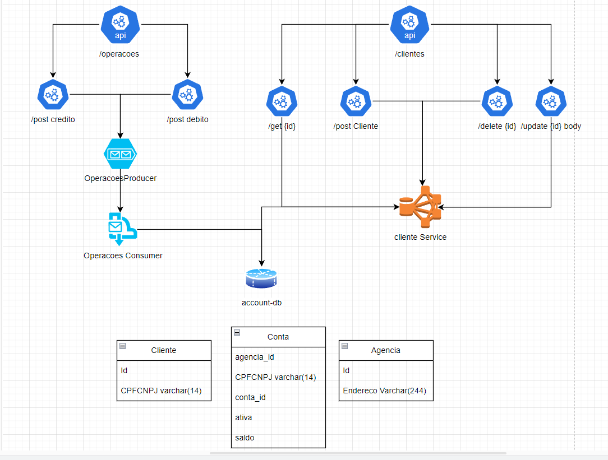

# Teste Santander

## Descrição
Este é um projeto de teste do Santander, que envolve operações bancárias, filas de mensagens e interações via API.

## Pré-requisitos
Certifique-se de que você tenha RabbitMQ e um banco de dados configurados antes de executar o projeto.

### Configuração do RabbitMQ
- Crie filas no RabbitMQ com os seguintes nomes: "fila-debito" e "fila-credito".

### Configuração do Banco de Dados
- Execute um novo banco de dados.
- Configure as informações do banco de dados em `src\main\resources\application.properties`.
- O esquema do banco de dados está disponível em `test\resources\schema.sql`.

## Funcionalidades Implementadas
- **Chave única para CPF:** Garantimos que cada CPF seja único no sistema.
- **Cadastro de Cliente e Operações Via API:** Implementamos a capacidade de cadastrar clientes e realizar operações bancárias via API. Note que também é possível cadastrar agências e contas via API.
- **Fila de Operações para Crédito e Débito:** Utilizamos filas de mensagens para processar operações de crédito e débito de forma assíncrona.

## Arquitetura utilizada

## Instância H2
- Uma instância H2 foi criada para facilitar o desenvolvimento e teste.

## Como Executar
- Execute o projeto após configurar o RabbitMQ e o banco de dados.

### Observações
Certifique-se de ajustar qualquer configuração adicional conforme necessário para o ambiente em que o projeto está sendo executado.

## Melhorias possiveis 
Para simplificar ainda mais o ambiente de desenvolvimento e facilitar a escalabilidade, considere adicionar as instâncias do RabbitMQ, do banco de dados e da aplicação ao Docker Compose. Isso tornará o processo de configuração mais consistente e fácil de reproduzir.
 
Mais testes também poderiam ser adicionados.
